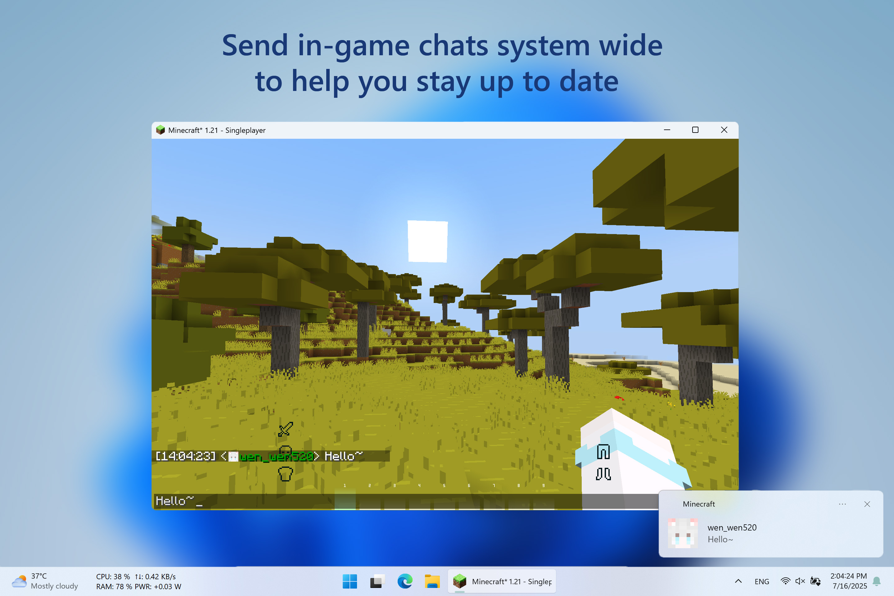

🌐
<a href="https://github.com/wen-wen520/Minecraft.Mod-MagpieBridge">English</a>
&nbsp;|&nbsp;
<a href="README.zh-cn.md">中文</a>

<h1>Magpie Bridge</h1>
<h2>A Minecraft mod that sends in game chats as System Notifications.</h2>

## 📋 Overview

Magpie Bridge is a lightweight Minecraft mod that brings your in-game chat messages directly to your desktop as system notifications!

## ❇️ Features

- **Native Windows Notifications:**
  Seamlessly integrates with Windows 10 and 11 notification systems.
- **Dark Mode Support:**
  Notifications match your system theme, including dark mode.
- **Unified Notification Center:**
  All Minecraft chat notifications appear in your Windows Notification Center for easy management and review.

## 🖼️ Gallery

[Modrinth Gallery](https://modrinth.com/mod/magpiebridge/gallery)

 

 

## ⚙️ Requirements

Architecture: x64\
System: Windows 10 version 15063.0 or higher\
Java: Java 21\
Minecraft: 1.20-1.20.1\

Fabric: 0.14.21
Fabric API: 0.83.0
YACL: 3.6.1
Mod Menu: 9.0.0 (Optional)

Forge: 46.0.14
YACL: 3.6.1

## ✅ Installation

Modrinth [[⬇️ Download]](https://modrinth.com/mod/magpiebridge/versions) provides a modern UI to choose and download this mod

GitHub [[📦 Releases]](https://github.com/wen-wen520/Minecraft.Mod-MagpieBridge/releases) Page is good to get the source code and pack them by self

## ⚙️ Configuration

### File Location:
`.minecraft\config\magpiebridge`

## 📃 Feedback

Welcome to [📑Issue Page](https://github.com/wen-wen520/Minecraft.Mod-MagpieBridge/issues/new/choose) to submit any bugs or features.

## 📜 License

[All rights reserved.](LICENSE.txt)

## 🎉 Thanks & Related Resource

[Go Toast / Toast](https://github.com/go-toast/toast) used to send system notifications.\
Under the MIT License.

[]
