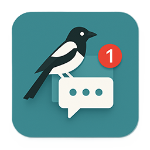

🌐
<a href="https://github.com/wen-wen520/Minecraft.Mod-MagpieBridge">English</a>
&nbsp;|&nbsp;
<a href="https://github.com/wen-wen520/Minecraft.Mod-MagpieBridge/blob/master/README.zh.md">中文</a>

<h1>鹊 桥 通 知</h1>
<h2>用于把游戏内聊天推送到系统通知栏的我的世界模组</h2>

## 📋 概览

Magpie Bridge 是一个轻量级的 Minecraft 模组，可以将你的游戏内聊天消息直接推送到桌面作为系统通知！

## ❇️ 功能

- **原生 Windows 通知：**
  无缝集成到 Windows 10 和 11 的通知系统中。
- **深色模式支持：**
  通知会根据你的系统主题自动适配，包括深色模式。
- **统一通知中心：**
  所有 Minecraft 聊天通知都会出现在 Windows 通知中心，方便管理和查看。

## 🖼️ 画廊

[Modrinth 画廊](https://modrinth.com/mod/magpiebridge/gallery)

 

 

## ⚙️ 要求

架构: 64位\
系统: Windows 10 版本 15063.0 或更高\
Java: 21\
Minecraft: 1.21 - 1.21.8\
Fabric: 0.16.10 或更高

## ✅ 安装

0. 检查你的设备和游戏版本是否符合 mod ⚙️ 要求
1. 下载并安装适用于你要玩的 Minecraft 版本的 [Fabric Loader](https://fabricmc.net/use/installer/)。
2. 下载 Mod

    Modrinth [[⬇️ 下载]](https://modrinth.com/mod/magpiebridge/versions) 首选，有现代化的操作界面，方便选择并下载该模组。

    Github [[📦 发布页]](https://github.com/wen-wen520/Minecraft.Mod-MagpieBridge/releases) 适合获取源代码并自行打包。

3. 将下载好的 `.jar` 文件放入 Minecraft 的 `mods` 文件夹。\
（Windows 系统一般路径为 `%appdata%/.minecraft/mods`）
4. 世界，启动！\
启动 Minecraft，开心的玩吧~

## ⚙️ 配置

### 文件位置：
`.minecraft\config\magpiebridge`\
不推荐手动编辑配置文件\
该目录下所有文件会在模组更新或降级时重置为默认值，\
除非在 `magpiebridge.json` 中将 `keepConfigDir` 设置为 `true`

>[!WARNING]\
>将 `keepConfigDir` 设置为 `true` 可能会在模组更新或降级时引发严重问题。\
>**请不要更改默认值，除非你非常清楚自己在做什么。**

### 配置选项：
| 键 | 描述 | 适用范围 | 默认值 | 游戏内编辑命令 |
|-----|-------------|-------|---------|---------|
| modVersion | 当前模组版本 | 系统 | 当前版本 | 不可编辑 |
| keepConfigDir | 在模组更新或降级时保留配置目录 | 系统 | false | `magpiebridge config general keepConfigDir [是否启用]` |
| notificationsEnabled | 所有桌面通知 | 全部 | true | `magpiebridge config general desktopNotifications [是否启用]` |
| playerNotifications | 玩家聊天通知 | Hypixel 空岛 | true | `magpiebridge config notifications skyblock player [是否启用]` |
| bazaarNotifications | 集市消息通知 | Hypixel 空岛 | true | `magpiebridge config notifications skyblock bazaar [是否启用]` |
| auctionNotifications | 拍卖消息通知 | Hypixel 空岛 | true | `magpiebridge config notifications skyblock auctions [是否启用]` |

## 📃 反馈

欢迎前往 [📑问题页面](https://github.com/wen-wen520/Minecraft.Mod-MagpieBridge/issues/new/choose) 提交任何 bug 或功能建议。

## 📜 许可

[保留所有权力](LICENSE.md)

## 🎉 致谢

[Go Toast / Toast](https://github.com/go-toast/toast) 用于发送系统通知\
在 MIT 许可证许可下使用

## 🌏 翻译

[文文](https://github.com/wen-wen520)